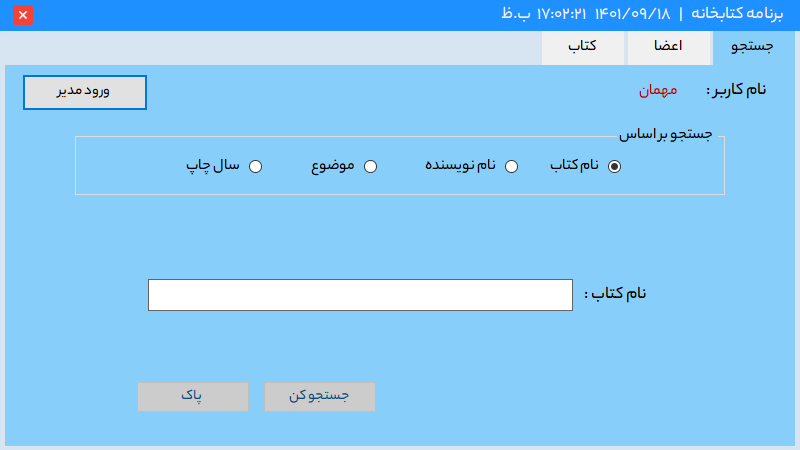
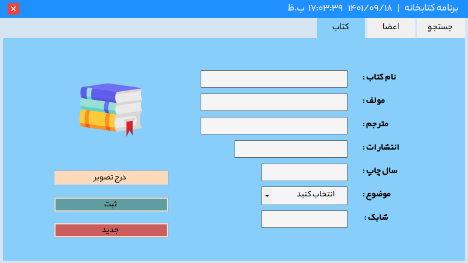

# LibraryManagement

Simple library management program template in persian and right to left format.\
Methods are not complete and this is only the template of the program.

## Features

> Administrators

- Special login form
- Manage members
- Manage books

> Clients

- Search books (on different bases)
- Read details of books

## Screenshots

| Administrators | Clients |
|:-------------------------:|:-------------------------:|
|  blah |  |
|  |  |